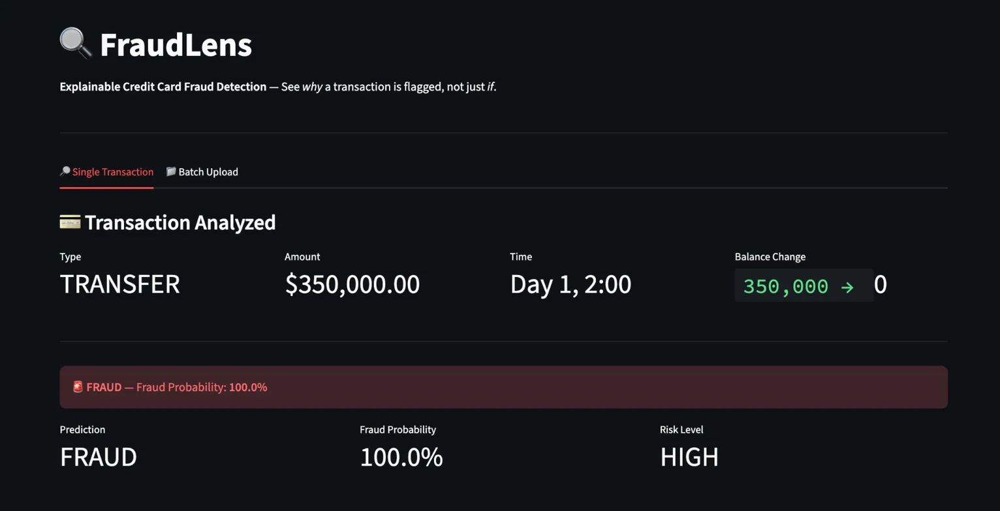
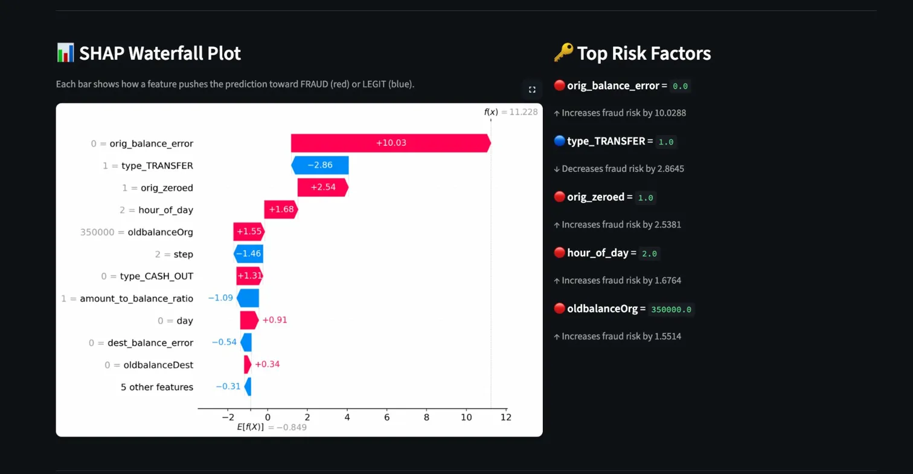
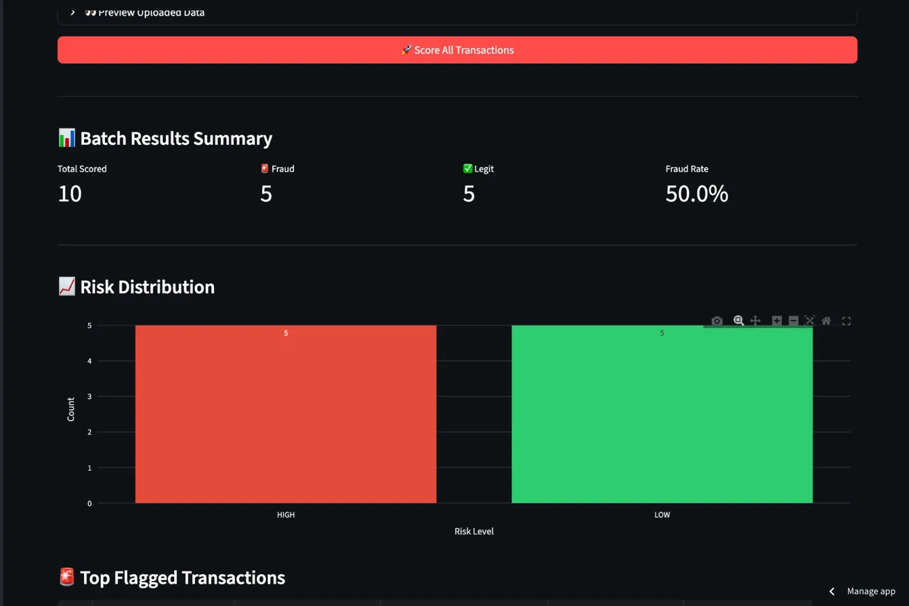

# 🔍 FraudLens


**Explainable Credit Card Fraud Detection** — A production-ready system that doesn't just predict fraud, it explains *why* each transaction is suspicious using SHAP.

### 🚀 [Live Demo](https://fraudlens-srujankothuri.streamlit.app/)

---

## The Problem

Credit card fraud costs the financial industry billions annually. Most ML models act as black boxes — they flag transactions but can't explain *why*. Regulators and analysts need transparency. FraudLens solves this by combining high-accuracy fraud detection with per-transaction explainability.

## What Makes This Different

Most fraud detection projects on GitHub stop at a Jupyter notebook with a confusion matrix. FraudLens is a **full end-to-end system:**

- Every prediction comes with an interactive **SHAP explanation** showing exactly which features drove the decision
- **Batch scoring** — upload a CSV of thousands of transactions, get risk scores + top risk factors for each
- **Deployed and live** — not just code in a repo, but a working application anyone can use
- **Tested and CI/CD** — 34 automated tests, linting, GitHub Actions pipeline

## Demo

### Fraud Detection with Transaction Details


### SHAP Explainability — Why Was It Flagged?


### Batch Scoring Dashboard


## Model Performance

Trained on 2.2M transactions from the [PaySim](https://www.kaggle.com/datasets/ealaxi/paysim1) synthetic financial dataset.

| Metric | Score |
|--------|-------|
| PR-AUC | 0.9981 |
| ROC-AUC | 0.9992 |
| Fraud Precision | 99.3% |
| Fraud Recall | 99.7% |
| Fraud F1 | 99.5% |

> **Why PR-AUC?** With 99.87% legitimate transactions, accuracy is misleading. PR-AUC measures how well the model balances catching fraud (recall) with avoiding false alarms (precision).

## Features

### 🔎 Single Transaction Analysis
Enter a transaction and get a fraud prediction with a full SHAP waterfall plot explaining which features pushed the decision toward fraud or legitimate.

### 📁 Batch Upload
Upload a CSV of transactions to score them all at once. Get a risk distribution summary, top flagged transactions, and download scored results.

### 📊 Explainability (SHAP)
Every prediction includes:
- **Waterfall plot** — step-by-step feature contributions from base value to final prediction
- **Interactive bar chart** — hoverable Plotly visualization of all feature impacts
- **Top risk factors** — human-readable explanations like *"account drained to $0 increases fraud risk by 2.53"*

## Tech Stack

| Layer | Tool | Purpose |
|-------|------|---------|
| Model | XGBoost | Industry standard for tabular fraud detection |
| Imbalance | SMOTE | Synthetic oversampling for 0.13% fraud rate |
| Explainability | SHAP | Per-prediction feature attributions (Shapley values) |
| Backend | FastAPI | REST API with auto-generated Swagger docs |
| Frontend | Streamlit | Interactive dashboard with visualizations |
| Testing | pytest (34 tests) | Unit tests for preprocessing, features, and API |
| CI/CD | GitHub Actions | Automated lint + test on every push |
| Container | Docker | Reproducible local setup via docker-compose |
| Deployment | Streamlit Cloud | Free hosted live demo |

## Architecture

```
┌──────────────┐     ┌──────────────────┐     ┌──────────────────┐
│  Raw Data    │────▶│  Preprocessing   │────▶│    Feature       │
│  (PaySim)    │     │  Clean + Split   │     │   Engineering    │
└──────────────┘     └──────────────────┘     └───────┬──────────┘
                                                      │
                                                      ▼
┌──────────────┐     ┌──────────────────┐     ┌──────────────────┐
│  Streamlit   │◀────│  SHAP Explainer  │◀────│  XGBoost Model   │
│  Dashboard   │     │  (TreeExplainer) │     │  (SMOTE + Train) │
└──────┬───────┘     └──────────────────┘     └──────────────────┘
       │                                              │
       │             ┌──────────────────┐             │
       └────────────▶│    FastAPI       │◀────────────┘
                     │  REST Endpoint   │
                     └──────────────────┘
```

## Project Structure

```
fraudlens/
├── src/
│   ├── data/preprocess.py          # Data loading, cleaning, splitting
│   ├── features/engineering.py     # 8 engineered fraud-signal features
│   ├── models/
│   │   ├── train.py                # SMOTE + XGBoost training pipeline
│   │   └── predict.py              # Prediction + SHAP explanations
│   └── api/app.py                  # FastAPI REST endpoints
├── streamlit_app/app.py            # Interactive dashboard (single + batch)
├── tests/                          # 34 tests (preprocessing, features, API)
├── models/                         # Trained model artifact
├── notebooks/                      # EDA & analysis
├── Dockerfile & docker-compose.yml # Containerized deployment
└── .github/workflows/ci.yml       # CI pipeline (lint + test)
```

## Quick Start

```bash
# Clone
git clone https://github.com/srujankothuri/FraudLens.git
cd FraudLens

# Setup
python -m venv venv
source venv/bin/activate  # Windows: venv\Scripts\activate
pip install -r requirements.txt

# Run Streamlit dashboard
streamlit run streamlit_app/app.py

# Or run FastAPI backend
uvicorn src.api.app:app --reload
# API docs at http://localhost:8000/docs

# Run tests
pytest -v

# Docker (optional)
docker-compose up
```

## Engineered Features

| Feature | Description | Fraud Signal |
|---------|-------------|-------------|
| `orig_balance_error` | Mismatch between expected and actual balance after transaction | Strongest predictor — balance manipulation |
| `orig_zeroed` | Account drained to $0 | Classic fraud: empty the account and run |
| `amount_to_balance_ratio` | Transaction amount as fraction of total balance | Ratio near 1.0 = taking everything |
| `is_off_hours` | Transaction between midnight and 6 AM | Fraudsters operate when victims sleep |
| `hour_of_day` | Hour extracted from transaction timestamp | Captures time-of-day patterns |
| `log_amount` | Log-transformed amount | Reduces skewness for better model performance |
| `dest_balance_error` | Mismatch in destination account balance | Money appearing/disappearing |
| `day` | Day of the month | Weak signal but captures minor patterns |

## API Usage

```bash
curl -X POST http://localhost:8000/predict \
  -H "Content-Type: application/json" \
  -d '{
    "step": 1,
    "type": "TRANSFER",
    "amount": 200000,
    "oldbalanceOrg": 200000,
    "newbalanceOrig": 0,
    "oldbalanceDest": 0,
    "newbalanceDest": 200000
  }'
```

Response includes prediction, probability, risk level, SHAP values, and human-readable explanations.

## License

MIT